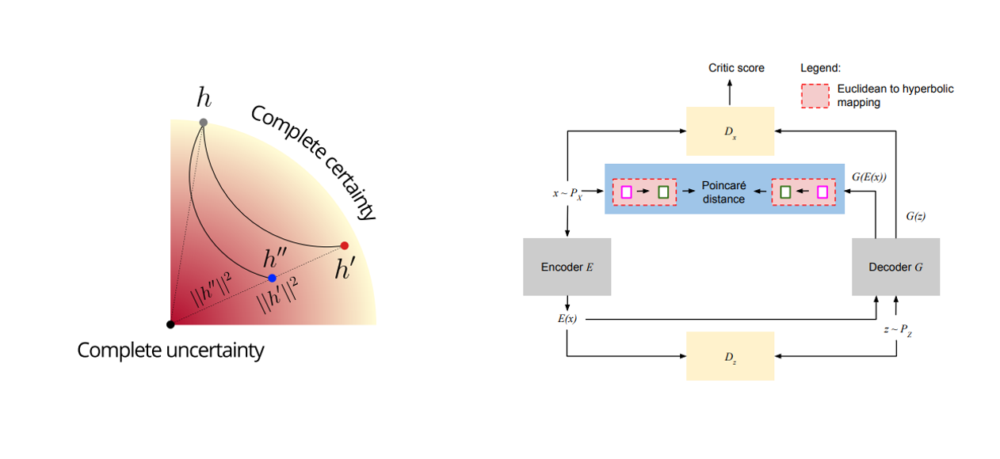

# Are we certain it's anomalous?


<p align="center">
    <a href="https://pytorch.org/get-started/locally/"></a>
</p>

The official PyTorch implementation of the **IEEE/CVF CVPR Visual Anomaly and Novelty Detection (VAND) Workshop** paper [**Are we certain it's anomalous?**](https://arxiv.org/abs/2211.09224).

Visit our [**webpage**](https://www.pinlab.org/hypad) for more details.



## Content
```
.
├── assets
│   └── teaser_hypad.png
├── anomaly_detection.py
├── configs
│   └── univariate.yaml
├── data
│   └── dataset.pickle
├── environment.yml
├── hyperspace
│   ├── hyrnn_nets.py
│   ├── losses.py
│   ├── poincare_distance.py
│   └── utils.py
├── LICENSE
├── main.py
├── math_.py
├── models
│   └── tadgan.py
├── README.md
├── train.py
└── utils
    ├── anomaly_detection_utils.py
    ├── dataloader_multivariate.py
    ├── dataloader.py
    ├── data.py
    └── utils.py
```
## Setup
### Environment
```
conda env create -f environment.yml
conda activate hypad
```

### Datasets
:warning: **UPDATE 04/05/2023** :warning:

At present, the univariate datasets are not available for download. To stay informed about the status of the site, please track this [issue](https://github.com/sintel-dev/Orion/issues/415) for updates.

The YAHOO dataset can be requested here https://webscope.sandbox.yahoo.com/catalog.php?datatype=s&did=70


### **Training+detector** on univariate signals 

To run TadGAN and HypAD, you must pass one of the signals associated with each dataset. 
You can find the list of datasets and signals in data/datasets.pickle.

All the univariate datasets, except for 'SMAP' and 'MSL', use the same set for train and test. 
When train == test, the flag unique_dataset must be set to True. 

To run HypAD:
```
python main.py --config configs/univariate.yaml
```
To run TadGAN just set the parameter **hyperbolic** to False


#### Once trained, you can run the **Detector**

Run the anomaly detector with the config used during trained which is stored in trained_models/models_{eucl/hyper}\_{signal}\_{epochs}_{lr}
```
python anomaly_detection.py --config trained_models/models_{eucl/hyper}_{signal}_{epochs}_{lr}/config.yaml
```
additional flags you can use:
1. How to compute the reconstruction error **rec_error** [dtw/area/point] (dtw by default) (not used with HypAD)
2. How to combine critic_score and reconstruction_error **combination** [mult/sum/rec/critic/uncertainty] (mult by default, uncertainty only for HypAD)


### **Training+detector** on multivariate signals 

To run HypAD:
```
python main.py --config configs/multivariate.yaml
```
To run TadGAN just set the parameter **hyperbolic** to False


#### Once trained, you can run the only **Detector**

Run the anomaly detector with the config used during trained which is stored in trained_models/models_{eucl/hyper}\_{signal}\_{epochs}_{lr}
```
python anomaly_detection.py --config trained_models/models_{eucl/hyper}_{signal}_{epochs}_{lr}/config.yaml
```
list of signals: [fall, weakness, nocturia. moretimeinchair, slowerwalking]

Ask flaborea@di.uniroma1.it for the multivariate dataset.


## Acknowledgements
We build upon [TadGAN](https://arxiv.org/abs/2009.07769).


